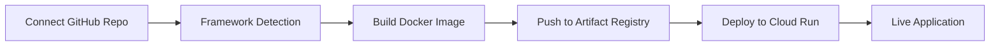

# DeployHub

  
  
  
  

  <strong>Deploy Your Code. In Seconds, Not Hours.</strong>

  A Vercel-like deployment platform that supports more frameworks, more languages, and container-first deployments — all powered by Go and Google Cloud.

---

## What is DeployHub?

DeployHub automatically detects your project's framework, builds the correct Docker image, and handles your deployment — **no YAML, no infra setup, no manual Docker work**.

Just connect your GitHub repo and deploy. That's it.

---

## Features

- **One-click deployments** from GitHub
- **Automatic framework detection** — no config needed
- **Docker-based builds** with custom Dockerfile support
- **Zero-config deployment**
- **Secure environment variable management**
- **Continuous deployment** via GitHub integration
- **Built in Go** for speed and reliability

---

## Supported Frameworks & Stacks

DeployHub automatically detects and deploys:

| Category | Frameworks |
|----------|-----------|
| **Frontend** | Next.js, React.js, Vite |
| **Backend** | FastAPI, Flask, Express, Node.js |
| **Go** | Native Go applications |
| **Static** | HTML, CSS, JavaScript |
| **Containers** | Custom Dockerfile |

> **Note:** If a `Dockerfile` is present in your repo, DeployHub will use it automatically.

---

## How It Works

1. **Connect** your GitHub repository via the DeployHub dashboard
2. **Detect** — DeployHub scans your repo to identify the framework
3. **Build** — Creates a framework-specific Docker image
4. **Push** — Uploads the image to GCP Artifact Registry
5. **Deploy** — Launches the container on Google Cloud Run
6. **Done** — Your app is live

All GCP authentication and infrastructure are handled internally — **you don't configure anything**.

---

## Usage

### 1. Connect GitHub

- Sign in to DeployHub
- Connect your GitHub account
- Select a repository to deploy

### 2. Configure Environment Variables

- Add environment variables via the dashboard
- Variables are securely injected during build and runtime
- No config files required

### 3. Deploy

- Click **Deploy**
- Sit back while DeployHub builds and ships your app
- Get your live URL instantly

---

## Environment Variables

Manage environment variables directly from the dashboard:

- Set key/value pairs before deployment
- Securely injected into containers
- No `.env` files or manual configuration

---

## Infrastructure

| Component | Technology |
|-----------|-----------|
| **Language** | Go (Golang) |
| **Build System** | Docker |
| **Registry** | Google Artifact Registry |
| **Runtime** | Google Cloud Run |
| **Source Control** | GitHub |

---

## Roadmap

Features currently in development:

- [ ] Custom domains
- [ ] Deployment rollbacks
- [ ] Real-time build & runtime logs
- [ ] Multi-region deployments
- [ ] Team collaboration features
- [ ] Analytics dashboard

---

## Contributing

Contributions are welcome! Here's how you can help:

1. Fork the repository
2. Create a feature branch (`git checkout -b feature/amazing-feature`)
3. Commit your changes (`git commit -m 'Add amazing feature'`)
4. Push to the branch (`git push origin feature/amazing-feature`)
5. Open a Pull Request

---

## Project Status

DeployHub is currently in **MVP → production-ready** stage and actively evolving.

Feedback, bug reports, and feature requests are always welcome.

---

## Vision

> **DeployHub aims to make cloud deployments boring** — no configs, no infra headaches, just push and deploy.

Deployment should be:
- **Simple** — One click, no setup
- **Automatic** — Smart detection, zero config
- **Reliable** — Docker + Cloud Run + Go = Rock solid
- **Universal** — Any framework, any language

---

## License

License information coming soon.

---

## Show Your Support

If you find DeployHub useful, please consider giving it a star on GitHub.
